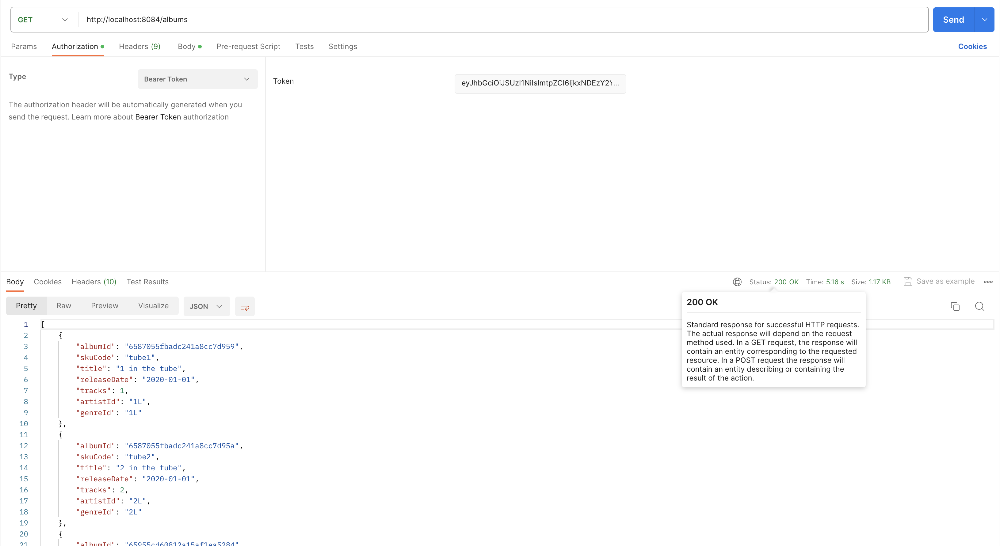
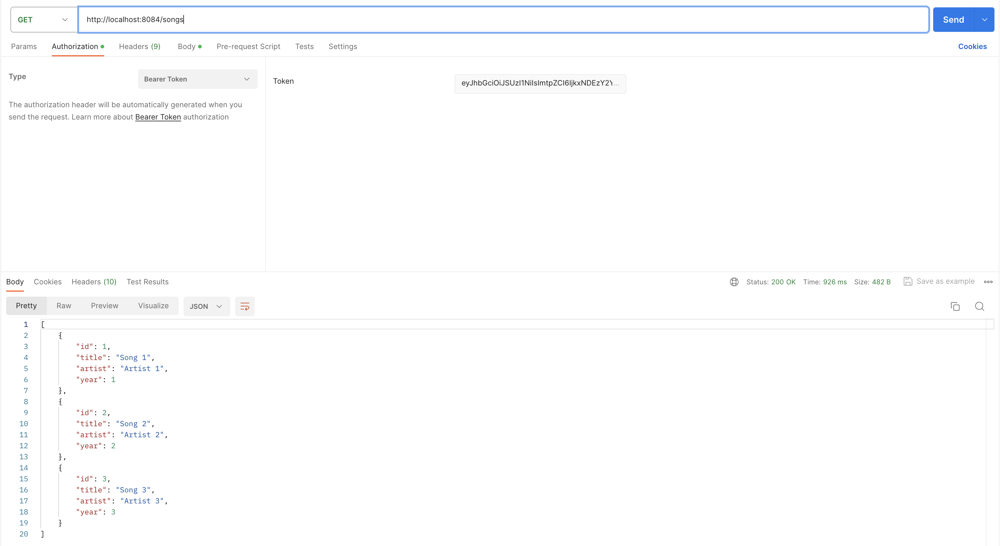
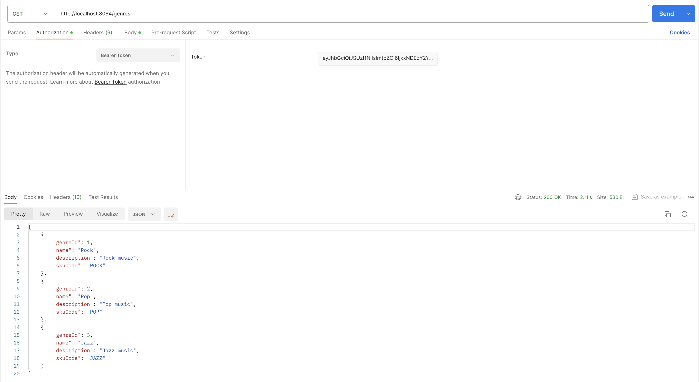
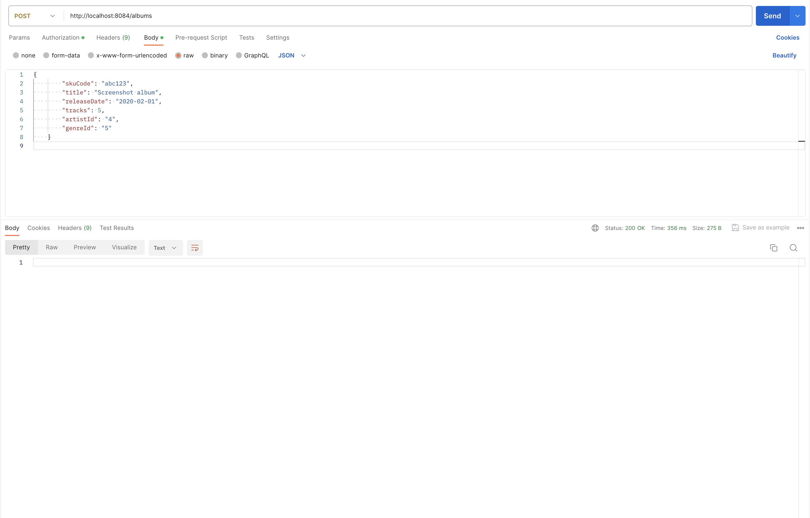
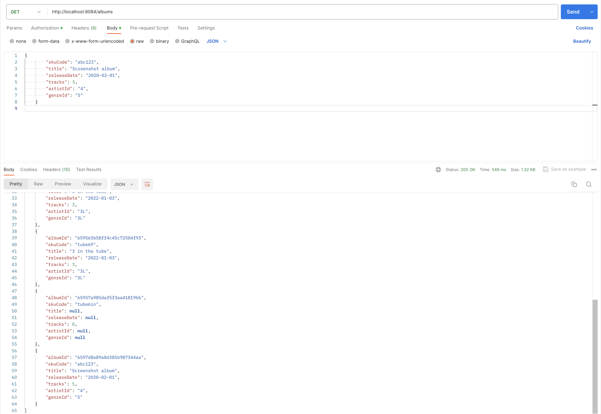
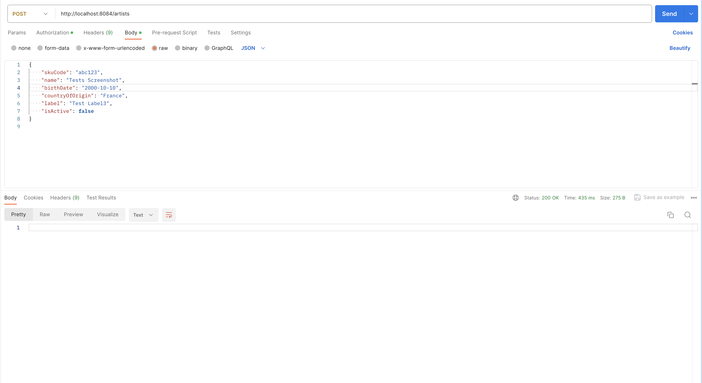
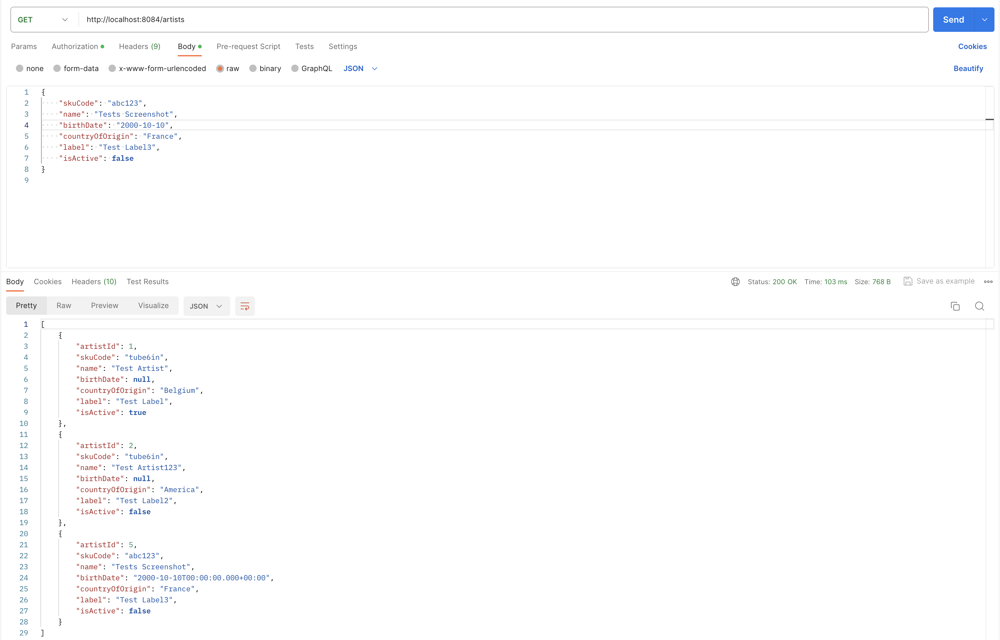
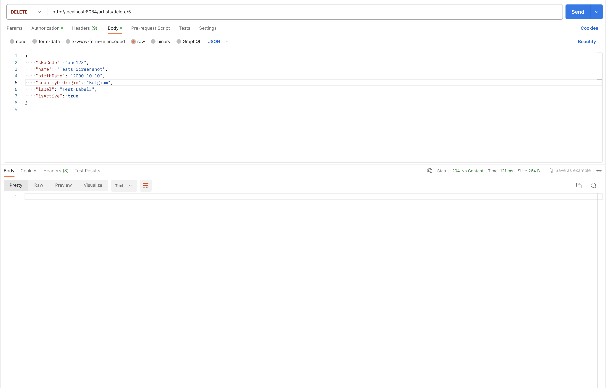
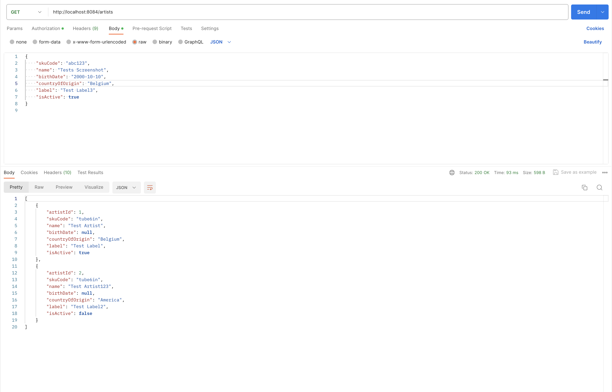
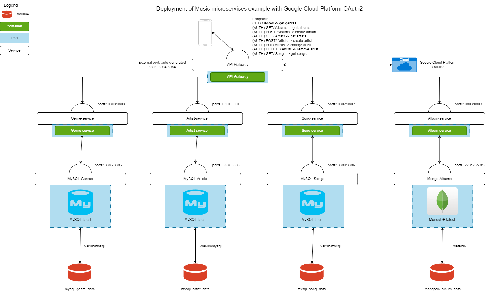

# Music Project

## Project Thema
Wij bijden hebben een enorme passie voor muziek en wilden graag deze passie combineren met ons project. 

## Microservices
We hebben gekozen om voor onze microservices gebruik te maken van de volgende services:
### Artist-service:
Een artist heeft een skuCode, naam, geboortedatum, land van herkomst, 
label en een boolean die aangeeft of de artiest nog actief muziek uitbrengt. 
Artists is verbonden met een mysql databese. 
        public class Artist {
            @Id
            @GeneratedValue(strategy = GenerationType.IDENTITY)
            private long artistId;
            private String skuCode;
            private String name;
            private Date birthDate;
            private String countryOfOrigin;
            private String label;
            private Boolean isActive;
        }
### Album-service:
Een album heeft een skuCode, titel, releaseDate, aantal tracks, artistId en een genreId.
Albums is verbonden met een MongoDB databese. 
        public class Album {
            @Id
            @Field("albumId")
            private String albumId;
            private String skuCode;
            private String title;
            private String releaseDate;
            private int tracks;
            private String artistId;
            private String genreId;
        }
### Genre-service:
Een genre heeft een naam, beschrijving en een skuCode.
Genres is verbonden met een mysql databese. 
        public class Genre {
            @Id 
            @GeneratedValue(strategy = GenerationType.IDENTITY)
            private Long genreId;
            private String name;
            private String description;
            private String skuCode;
        }
### Song-service:
Een song heeft een titel, artist en een jaar van uitgave.
Songs is verbonden met een mysql databese. 
        public class Song {
            @Id
            @GeneratedValue(strategy = GenerationType.IDENTITY)
            private long id;
            private String title;
            private String artist;
            private int year;

            public Song(String title, String artist, int year) {
                this.title = title;
                this.artist = artist;
                this.year = year;
            }
            
        }

We zijn voor deze microservices gegaan omdat deze heel handig zijn bij het opzoeken van informatie over een bepaalde artiest, album, genre of song.
Elk Album bestaat uit een artist, genre en songs.

## API Gateway
Onze api gateway is een spring cloud gateway. Deze zorgt ervoor dat de requests van de client naar de juiste microservice worden gestuurd.
Al onze api calls zijn beveiligd met oauth2.0. De api gateway zorgt ervoor dat de client een token kan aanvragen en deze kan gebruiken om de api calls beveiligd te doen.
Enkel de genres kunnen zonder token worden opgevraagd.

        @Configuration
        @EnableWebFluxSecurity
        public class SecurityConfig {

                @Bean
                public SecurityWebFilterChain springSecurityFilterChain(ServerHttpSecurity serverHttpSecurity) {
                        serverHttpSecurity
                                        .authorizeExchange(exchange -> exchange.pathMatchers(HttpMethod.GET, "/genres")
                                                        .permitAll()
                                                        .anyExchange()
                                                        .authenticated())
                                        .oauth2ResourceServer(oauth2 -> oauth2
                                                        .jwt(withDefaults()));
                        return serverHttpSecurity.build();
                }
        }

We zijn gegaan voor 4 get calls. Eén get per microservice. Zo konden we makkelijk de informatie van een bepaalde microservice opvragen. Vorvolgens hebben we 2 post calls gemaakt. Eén voor het toevoegen van een album en één voor het toevoegen van een artiest.

Dan hebben we ook nog 1 put en 1 delete call gemaakt. Deze zijn voor het aanpassen en verwijderen van artisten.

        server:
        port: 8084

        logging:
        level:
            root: INFO
            org.springframework.cloud.gateway: TRACE
            org.springframework.cloud.gateway.route.RouteDefinitionRouteLocator: INFO
            reactor.netty: TRACE

        spring:
        security:
            oauth2:
            client:
                registration:
                google:
                    client-id: ${GOOGLE_CLIENTID}
                    client-secret: ${GOOGLE_CLIENTSECRET}
                    scope: openid,profile,email
            resourceserver:
                jwt:
                issuer-uri: https://accounts.google.com
                jwk-set-uri: https://www.googleapis.com/oauth2/v3/certs
        cloud:
            gateway:
            routes:
                - id: artist-service
                uri: http://${ARTIST_SERVICE_BASEURL:localhost:8080}
                predicates:
                    - Path=/artists
                    - Method=GET
                filters:
                    - SetPath=/api/artists
                - id: genre-service-all
                uri: http://${GENRE_SERVICE_BASEURL:localhost:8080}
                predicates:
                    - Path=/genres
                    - Method=GET
                filters:
                    - SetPath=/api/genres
                - id: song-service-all
                uri: http://${SONG_SERVICE_BASEURL:localhost:8080}
                predicates:
                    - Path=/songs
                    - Method=GET
                filters:
                    - SetPath=/api/songs
                - id: album-service
                uri: http://${ALBUM_SERVICE_BASEURL:localhost:8080}
                predicates:
                    - Path=/albums
                    - Method=GET
                filters:
                    - SetPath=/api/albums
                - id: post-album
                uri: http://${ALBUM_SERVICE_BASEURL:localhost:8080}
                predicates:
                    - Path=/albums
                    - Method=POST
                filters:
                    - SetPath=/api/albums
                - id: edit-artist
                uri: http://${ARTIST_SERVICE_BASEURL:localhost:8080}
                predicates:
                    - Path=/artists/update/**
                    - Method=PUT
                filters:
                    - RewritePath=/artists/update/(?<artistId>.*), /api/artists/${artistId}
                - id: delete-artist
                uri: http://${ARTIST_SERVICE_BASEURL:localhost:8080}
                predicates:
                    - Path=/artists/delete/**
                    - Method=DELETE
                filters:
                    - RewritePath=/artists/delete/(?<artistId>.*), /api/artists/${artistId}
                - id: post-artist
                uri: http://${ARTIST_SERVICE_BASEURL:localhost:8080}
                predicates:
                    - Path=/artists
                    - Method=POST
                filters:
                    - SetPath=/api/artists

### De 4 get calls:

### De 2 post calls:

#### Album post call:

#### Artist post call:

### De put call:

### De delete call:

## Deployment Diagram

## Kubernetes
We hebben gekozen om de uitbreiding van Prometheus en Grafana te doen. 

Prometheus:

Grafana:

## Hosting
Ons project is niet gehost, dit komt omdat wij te laat waren om een okteto account aan te maken. Dit is waarom we dit locaal hosten op docker.

